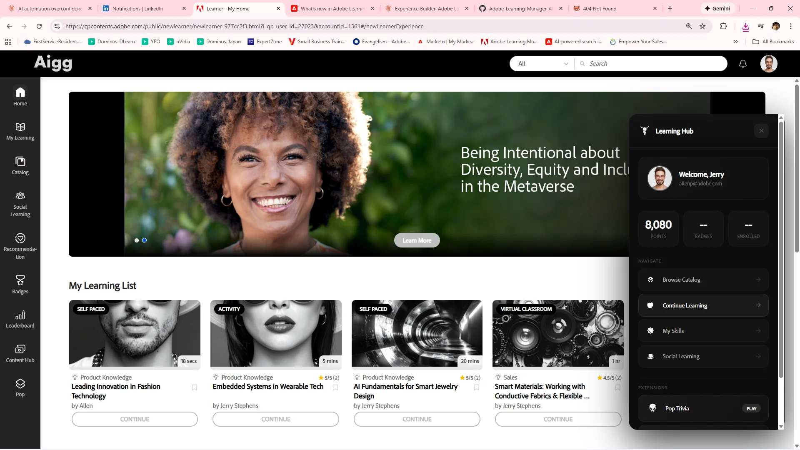

# ALM Front Page JS Injection

Leverage Adobe Learning Manager's full client-side SDK to build custom experiences - featuring the Learning Hub panel with Brutalist Bob iconography and iframe-based extension popups.

## 🚀 A New Era for ALM Customization


*The Learning Hub panel floating over a live ALM instance - showing user profile, stats, navigation, and extensions*

I'm genuinely thrilled about this capability. The front page JavaScript injection feature doesn't just let you style things - **Adobe has exposed the entire application layer.**

This is a full SDK with:
-  **Authentication & Tokens** - CSRF tokens, native extension tokens, commerce tokens
-  **User Data Access** - Read and write user profiles, custom fields
-  **Navigation API** - Programmatic routing through official navigation system
-  **Configuration Access** - API endpoints, mounting points, widget config
-  **Theme Awareness** - Full theme object with colors, fonts, branding

You're not in a sandbox. The `primeApiURL` + `nativeExtensionToken` gives you the same API access that headless integrations use - headless LMS capabilities inside the headed experience.

In this example alone, we demonstrate:
- **User Profile Recognition** - Greet learners by name, show their progress, celebrate their achievements
- **Dynamic Site Navigation** - Surface the content that matters most, right where learners need it
- **Custom External Application Integration** - Pop Trivia, Badge Maker, and whatever else you can dream up - all accessible via sleek iframe popups without leaving the ALM experience

But this is just the beginning.

## 💡 The Real Potential: Gamification On The Fly

Imagine what becomes possible when you can inject custom experiences directly into your learning platform:

### Token Collection & Avatar Customization
Build reward systems where learners collect tokens for completing courses, hitting milestones, or engaging with content. Let them spend those tokens on:
- **Avatar accessories** - Add a hat, swap in some cool glasses, throw on a leather jacket
- **Digital swag** - Unlock branded gear for their virtual presence
- **Custom badges** - Beyond the standard completion badges, create collectible achievements

### Company Car Configurator
Why not? Learners who complete your sales certification program unlock the ability to customize their virtual company car - new paint job, racing stripes, custom plates. Silly? Maybe. Memorable and motivating? Absolutely.

### Leaderboards & Competitions
Inject real-time leaderboards for training sprints. Run department vs. department challenges. Create seasonal events with limited-time rewards.

### Interactive Learning Companions
Remember Clippy? Now imagine something actually helpful - an AI-powered study buddy that lives in a corner of the page, offering encouragement, quiz questions, or personalized recommendations based on where the learner is struggling.

### Escape Rooms & Treasure Hunts
Hide clues across your learning catalog. Completing certain courses reveals pieces of a puzzle. First team to solve it wins... something cool.

The point is: **your imagination is now the limit, not the platform.**

## Features

- **Dark Theme Panel** - Sleek, modern dark UI that floats on the ALM page
- **Brutalist Bob Icons** - Custom hand-drawn SVG icons for visual personality
- **ALM API Bridge** - Connects to ALM's public REST API for real learner data
- **Iframe Extension Popups** - Opens tools in draggable, resizable panels - no new tabs, no context switching
- **Real-time Stats** - Shows enrollment count, completed courses, badges earned, and skill points

## Quick Start

### Option 1: Browser Console (Development)

1. Open your ALM instance in the browser
2. Open Developer Tools (F12)
3. Paste the contents of `learning-hub.js` into the console
4. Press Enter

### Option 2: ALM Custom JavaScript (Production)

1. Log into ALM as Administrator
2. Navigate to **Settings > Branding > Header**
3. Add the script via the Custom JavaScript option
4. Save and publish

### Option 3: Bookmarklet

Create a bookmarklet with this code:
```javascript
javascript:(function(){var s=document.createElement('script');s.src='YOUR_HOSTED_URL/learning-hub.js';document.body.appendChild(s);})();
```

## Configuration

Edit the `CONFIG` object at the top of `learning-hub.js`:

```javascript
const CONFIG = {
  panelId: 'alm-learning-hub-bb',
  iframeId: 'alm-extension-popup',
  position: { top: '80px', right: '20px' },
  width: '340px',
  extensions: {
    popQuiz: {
      url: 'https://p0qp0q.com/alm-quiz/',
      title: 'Pop Trivia',
      width: '570px',
      height: '980px'
    },
    badgeMaker: {
      url: 'https://www.p0qp0q.com/badgemaker/five/index.html',
      title: 'Badge Maker',
      width: '900px',
      height: '700px'
    }
  }
};
```

## Adding Custom Extensions

Add new extensions to the `CONFIG.extensions` object:

```javascript
extensions: {
  avatarBuilder: {
    url: 'https://your-domain.com/avatar-builder/',
    title: 'Customize Your Avatar',
    width: '800px',
    height: '600px'
  },
  tokenShop: {
    url: 'https://your-domain.com/token-shop/',
    title: 'Rewards Shop',
    width: '900px',
    height: '700px'
  }
}
```

Then add buttons in the `renderContent()` function:

```javascript
<button class="ext-btn" onclick="window.openExtensionPopup('avatarBuilder')">
  <span class="icon">${ICONS.alien}</span>
  Customize Avatar
  <span class="badge">New!</span>
</button>
```

## ALM SDK Reference

The `window.ALM` object provides a comprehensive SDK:

### Authentication & Tokens
```javascript
ALM.getCsrfToken()              // CSRF protection token
ALM.getNativeExtensionToken()   // API auth token (natext_...)
ALM.getCommerceToken()          // E-commerce integration
ALM.isPrimeUserLoggedIn()       // Session state check
```

### User Data
```javascript
const user = await ALM.getALMUser()     // Get learner profile
await ALM.updateALMUser(data)           // Write to profile
ALM.getAccountActiveFields()            // Custom fields
```

### Navigation
```javascript
ALM.navigateToCatalogPage()
ALM.navigateToMyLearningPage()
ALM.navigateToSkillsPage()
ALM.navigateToBadgesPage()
ALM.navigateToLeaderboardPage()
ALM.navigateToSocial()
ALM.navigateToTrainingOverviewPage()
ALM.navigateToCustomPage()      // Your Experience Builder pages
```

### Configuration
```javascript
const config = ALM.getALMConfig() // or ALMConfig

config.primeApiURL      // REST API endpoint (https://learningmanager.adobe.com/primeapi/v2/)
config.mountingPoints   // DOM selectors for components
config.themeData        // Full theme (colors, fonts, everything)
config.widgetConfig     // Widget system configuration
```

### Direct API Access

With the API URL and token, you can call the Learning Manager REST API directly:

```javascript
const response = await fetch(`${ALMConfig.primeApiURL}user`, {
  headers: {
    'Authorization': `oauth ${ALM.getNativeExtensionToken()}`
  }
});
const userData = await response.json();
```

See the [full SDK documentation](docs/HOW-IT-WORKS.md#the-alm-bridge-talking-to-learning-manager) for complete details.

## File Structure

```
ALM-FrontPageJSInjection/
├── learning-hub.js          # Main injection script
├── README.md                # This file
├── LICENSE                  # MIT License
└── examples/
    └── custom-extension.js  # Example extension template
```

## Brutalist Bob Icons

The panel uses custom SVG icons in the "Brutalist Bob" style - hand-drawn, slightly imperfect, full of character. All icons are white with transparent backgrounds, designed to be displayed on dark surfaces.

### Sample Icons

<div style="background: #1a1a1a; padding: 20px; border-radius: 8px; display: inline-block;">
  
  
  
  
  
  
  
  
  
  
</div>

### Icon Library (79 icons)

| Icon | Filename | Suggested Use |
|------|----------|---------------|
|  | `boxMod.svg` | Course catalog, content library |
|  | `apple.svg` | My Learning, progress, health |
|  | `gear.svg` | Skills, competencies, settings |
|  | `alien.svg` | Fun features, easter eggs |
|  | `cowSkull.svg` | Achievements, challenges |
|  | `robot.svg` | AI features, automation |
|  | `atomic.svg` | Science, technical content |
|  | `lightbulb.svg` | Ideas, tips, recommendations |
|  | `heart.svg` | Favorites, likes, wellness |
|  | `eye.svg` | View, preview, visibility |
|  | `man.svg` | User profile, learner |
|  | `woman.svg` | User profile, learner |
|  | `sailboat.svg` | Journey, progress, navigation |
|  | `car.svg` | Fast track, acceleration |
|  | `guitar.svg` | Creative courses, arts |
|  | `coffee.svg` | Break time, casual learning |
|  | `burger.svg` | Menu, options |
|  | `strawberry.svg` | Rewards, sweet achievements |

**All 79 icons available in the [icons/](icons/) directory**, including: numbers (one-ten), food (noodles, toast, bento, raman, kiwi), objects (axe, hatchet, tank, handcuffs), symbols (infinity, spirals, hearts), and more!

## Browser Support

- Chrome 80+
- Firefox 75+
- Safari 13+
- Edge 80+

## Security Notes

- Script requires same-origin or CORS-enabled hosting for iframe extensions
- Uses ALM's authenticated session - no credential storage
- All API calls go through ALM's official REST endpoints
- Extensions run in sandboxed iframes for isolation

## What Will You Build?

This toolkit is a starting point. The real magic happens when you take these patterns and create something uniquely yours - something that makes your learners smile, engages them in unexpected ways, and transforms compliance training into an experience they actually look forward to.

Drop me a line if you build something cool. I'd love to see it.

## License

MIT License - See [LICENSE](LICENSE) file

## Author

**Dr. Allen Partridge**  
Director of Product Evangelism, Adobe Learning Manager  
[LinkedIn](https://www.linkedin.com/in/allenpartridge/) 

---

*Part of the Adobe Learning Manager customization toolkit*

*"The best learning experiences don't feel like learning at all."*
